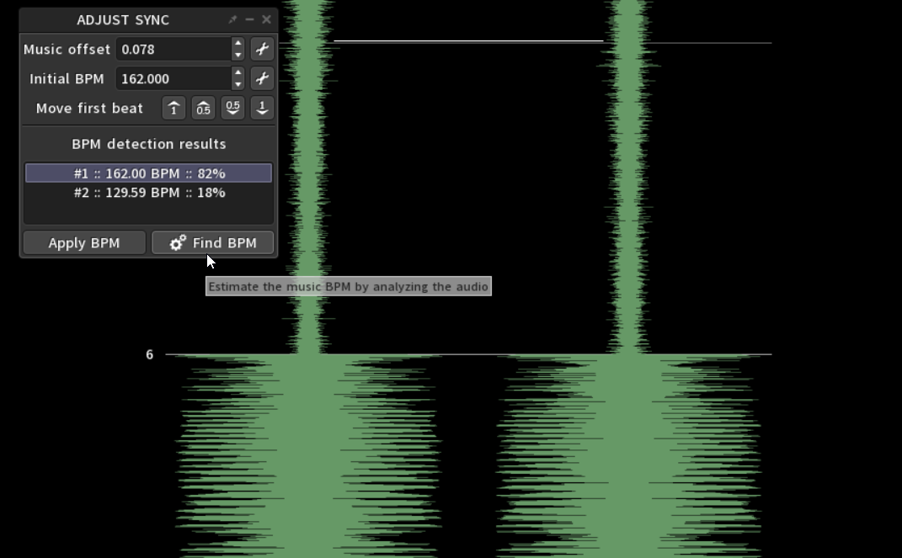

import { Aside } from "@astrojs/starlight/components"

The most important step before placing down any notes is ensuring your tempo markers are set correctly.
There are multiple methods to achieve this.

<Aside type='tip'>
If you prefer video guides, this [video](https://www.youtube.com/watch?v=HtAC0mfkc4w) by **CrookyCumbles** is for you. It's based on an outdated build
of the game but the editor UI is nearly identical so its' contents are still relevant.
</Aside>

## Finding the BPM and offset

When dealing with any decently popular track, the BPM can be easily found with a Google search, with results coming up from websites like **[TuneBat](https://tunebat.com/)**.
Alternatively: 
    - Use **[Arrow Vortex](https://arrowvortex.ddrnl.com/)**, a tool for creating charts for games like DDR, ITG, StepMania and more. 
    It comes with a **BPM and offset detection tool** that is reliable enough in most cases.
    - Cross-reference the tempomap from a completed chart of your song in a different game like **[osu!](https://osu.ppy.sh/beatmapsets)** or **[Quaver](https://quavergame.com/maps)**.
    - Use the in-game BPM tapper tool and set the offset manually.

### Using Arrow Vortex

Start by downloading and unzipping the program's files anywhere. You may need [7-Zip](https://www.7-zip.org/) to complete this step.
Next, launch `ArrowVortex.exe`. You'll be presented with the following view:


Next:

    1. Drag-and-drop, or `File -> Open...` your [exported](../../audio-setup/basic-audio-setup#exporting-with-audacity) audio file. 
    2. In `View`, enable `Time based (C-mod)`. This will allow you to see the waveform of the track.
    You can zoom further in and out with `Ctrl + Mouse wheel`.
    3. In `Tempo`, click on `Adjust sync...`. You'll be presented with the following menu: 

        

    4. Click on  `Find BPM`. Shortly after, AV will return one or more results:

        

        > Arrow Vortex can return multiple results whenever you're working with tracks that may have an "unquantized" section 
        > (most likely the intro like in this example).  
        > Furthermore, its' most confident result could have an unrounded BPM value or a slightly incorrect offset. 
        > It is usually safe to round up the BPM value unless it is that exact.  
        > As for the offset, AV might've placed the beat one or two ticks forward/back. Use the buttons next to `Move first beat` to adjust it.
        > Then, you can zoom in even further to make tiny adjustments (in the order of milliseconds) to accurately match the beat ticks to the waveform.
    
    5. Enable the **metronome** by pressing `F3`, listen through the track and make any necessary adjustments to accurately match the waveform with the beat ticks.

    | Original result | Adjusted |
    | :---: | :---: |
    |  |  |

    In the example above, the offset was adjusted by one beat up, then incremented by `+0.007`, yielding the new offset result of `0.078`.
    This value, alongside the BPM, will be the value you assign to the **first BPM marker** in your chart in the SRXD editor. Take note of it somewhere.

<Aside type='caution'>
Arrow Vortex treats the offset value in the opposite direction, compared to SRXD. In this case, you'll have to invert it, making the end result `-0.078`.
</Aside>

### Using charts from other games

If the song you're charting is available on other community-driven rhythm games, you can reference their tempomap in your own SRXD chart.
Let's use a **Quaver** chart as an example. We can read its' contents with any simple text editor, like **[Notepad++](https://notepad-plus-plus.org/downloads/)**.

```
AudioFile: audio.mp3
SongPreviewTime: 68249
BackgroundFile: ...
MapId: ...
MapSetId: ...
Mode: Keys4
Title: ...
Artist: ...
Source: ''
Tags: ...
Creator: ...
DifficultyName: ...
Description: ...
EditorLayers: []
TimingPoints:
- StartTime: 9321
  Bpm: 125.999992
```

The `TimingPoints` field contains all the tempo markers in the chart, and the first one in the list indicates the `StartTime`, 
which in our case would be the offset (in milliseconds), and the BPM.

### Using the in-game BPM tap tool 

Lastly, you have the option to tap out the BPM manually using the in-game tool in the Clip Info editor.
To access it, cycle through the editor modes using the `` ` `` key (backtick, by default) and click on any tempo marker.


To double check the accuracy of your values, you can let the song play and enable the metronome with the dedicated button above, 
or with the `Shift + C` global hotkey combo.

## Adjusting the first tempo marker

Now that we've determined the correct BPM and offset values for your track, it's time to use them in our SRXD chart.

First, find a sound in the music with a short attack, such as a kick drum, that lands on the start of a measure. A sharper sound leads to a sharper waveform, 
which will allow you to more accurately determine the offset of the tempomap.


<Aside type='caution'>
Depending on the music, you may not be able to find a sound that registers sharply on the waveform. Another way to get a decent offset is to find a good candidate sound, 
slow down the song (with the `P` key), enable metronome (with the keyboard combo `Shift + C` or the button at the top right of the clip info editor screen) and listen for whether the sound
lines up correctly with the metronome. 
</Aside>

Then you can click and drag the tempo marker to adjust the measure numbers such that they line up with the sound you have chosen.

Use the mouse scroll wheel to zoom in and make finer adjustments. Do this after moving the measure marker in the previous step first, because moving the tempo marker
is slower proportional to the zoom level.
